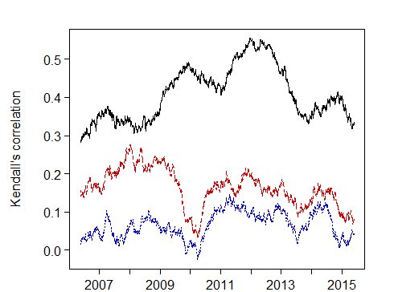

[](http://quantlet.de/index.php?p=info)

## [](http://quantlet.de/) **COPRollingcorr** [](http://quantlet.de/d3/ia)


```yaml

Name of Quantlet: COPRollingcorr

Published in: Time-varying Hierarchical Archimedean Copulas Using Adaptively Simulated Critical Values

Description: 'Calculates and plots Kendall's tau and Pearson's correlation coefficient in a rolling window 
of m = 250 observations for the pairs of residuals from fitting GARCH(1,1) to the log returns of indices 
(DAX, Dow Jones and Nikkei).'

Keywords: Kendalls Tau, correlation, log-returns, plot, time varying

See also: 

Author: [New] + Ramona Steck

Submitted:  

Datafile: eps, dates

Input: 

Output:  

Example: 

```





```R
# clear all variables
rm(list = ls(all = TRUE))
graphics.off()

# install and load packages
libraries = c("zoo")
lapply(libraries, function(x) if (!(x %in% installed.packages())) {
    install.packages(x)
})
lapply(libraries, library, quietly = TRUE, character.only = TRUE)

# specify working directory and prepare dates for the plot
# setwd("...")
dates     = read.table("dates")
dates     = dates[-c(1:5576), ]
dates     = as.matrix(dates)
labels    = as.numeric(format(as.Date(dates, "%Y-%m-%d"), "%Y"))
where.put = c(which(diff(labels) == 1) + 1)

# residuals from fitting GARCH(1,1)
eps = read.table("eps")

# Kendalls tau and Pearsons correlation coefficients using rolling window m = 250
Pearson           = matrix(nrow = (nrow(eps) - 249), ncol = 3)
Kendall           = matrix(nrow = (nrow(eps) - 249), ncol = 3)
colnames(Pearson) = c("DDJ", "DN", "DJN")
colnames(Kendall) = c("DDJ", "DN", "DJN")

DAXDJ        = eps[, 1:2]
TS           = zoo(DAXDJ)
Pearson[, 1] = rollapply(TS, width = 250, by = 1, function(TS) cor(TS[, 1], TS[, 2]), by.column = FALSE, 
    align = "right")
Kendall[, 1] = rollapply(TS, width = 250, by = 1, function(TS) cor(TS[, 1], TS[, 2], method = c("kendall")), 
    by.column = FALSE, align = "right")

DAXNI        = eps[, c(1, 3)]
TS           = zoo(DAXNI)
Pearson[, 2] = rollapply(TS, width = 250, by = 1, function(TS) cor(TS[, 1], TS[, 2]), by.column = FALSE, 
    align = "right")
Kendall[, 2] = rollapply(TS, width = 250, by = 1, function(TS) cor(TS[, 1], TS[, 2], method = c("kendall")), 
    by.column = FALSE, align = "right")

DJNI         = eps[, c(2, 3)]
TS           = zoo(DJNI)
Pearson[, 3] = rollapply(TS, width = 250, by = 1, function(TS) cor(TS[, 1], TS[, 2]), by.column = FALSE, 
    align = "right")
Kendall[, 3] = rollapply(TS, width = 250, by = 1, function(TS) cor(TS[, 1], TS[, 2], method = c("kendall")), 
    by.column = FALSE, align = "right")

# the plots
par(mai = (c(0, 0.8, 0.1, 0.1) + 0.4), mgp = c(3, 0.5, 0))
plot.colors = c("black", "red3", "blue3")

matplot(Pearson, type = "l", lty = 1:3, col = plot.colors[1:3], lwd = 1, las = 1, axes = F, frame = T, 
    ann = F)
axis(1, at = where.put, labels = labels[where.put], tck = -0.02)
axis(2, las = 1, tck = -0.02)
mtext(side = 2, text = "Pearson's correlation", line = 3, cex = 1)

matplot(Kendall, type = "l", lty = 1:3, col = plot.colors[1:3], lwd = 1, las = 1, axes = F, frame = T, 
    ann = F)
axis(1, at = where.put, labels = labels[where.put], tck = -0.02)
axis(2, las = 1, tck = -0.02)
mtext(side = 2, text = "Kendall's correlation", line = 3, cex = 1) 

```
